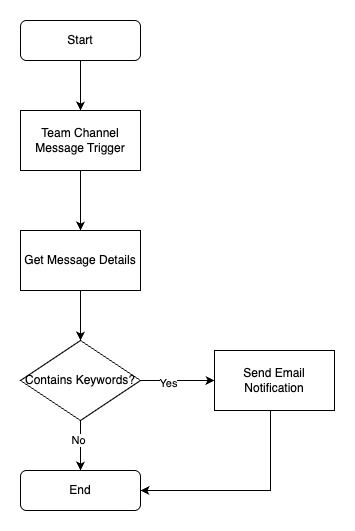
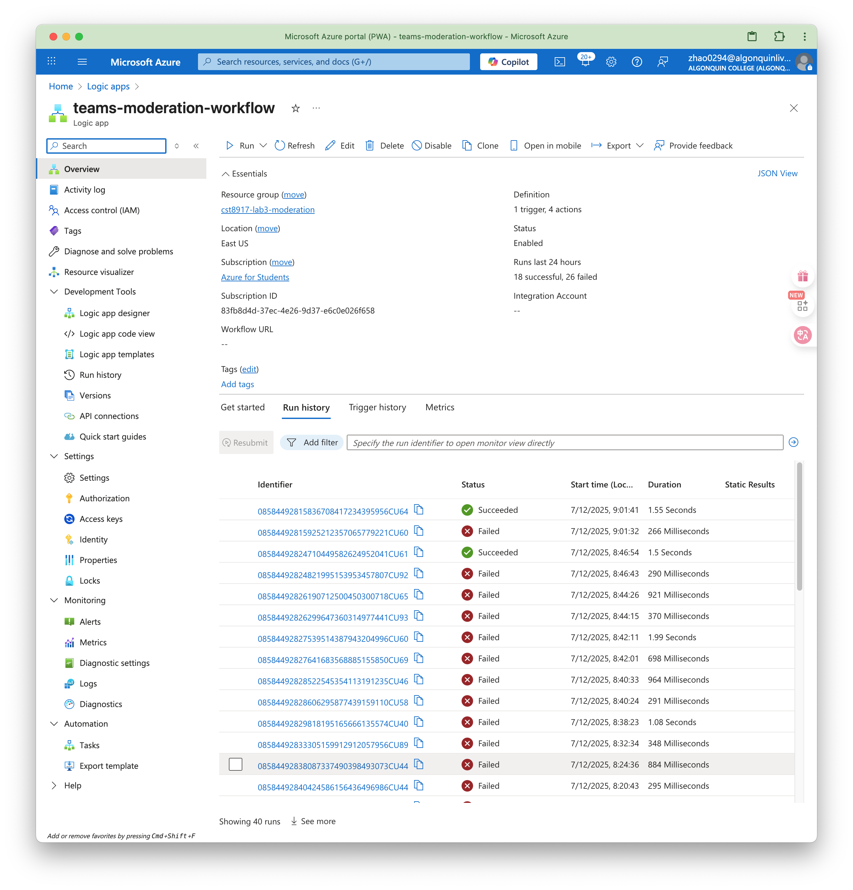
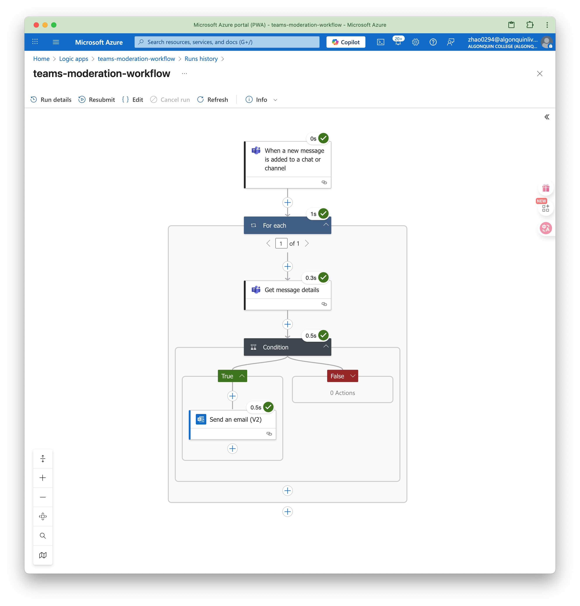

# CST8917 Lab 3: Microsoft Teams Chat Content Moderation Service

## Overview

This project implements a **Microsoft Teams chat content moderation service** using **Azure Logic Apps**. The service monitors messages in a specified Teams channel for inappropriate content and automatically sends an email notification to an administrator when a violation is detected.

---

## Table of Contents

- [Overview](#overview)
- [Azure Configuration](#azure-configuration)
- [Architecture Flowchart](#architecture-flowchart)
- [Logic App Workflow Description](#logic-app-workflow-description)
- [Testing & Results](#testing--results)
- [Challenges & Solutions](#challenges--solutions)
- [Future Improvements](#future-improvements)
- [Demo Video](#demo-video)

---

## Azure Configuration

### Project Information
- **Project Name**: Teams Chat Content Moderation Service
- **Resource Group**: cst8917-lab3-moderation
- **Region**: East US
- **Subscription**: Azure for Students

### Azure Resources Created

#### 1. Resource Group
- **Name**: cst8917-lab3-moderation
- **Location**: East US
- **Status**: Created

#### 2. Azure Logic App
- **Name**: teams-moderation-workflow
- **Type**: Microsoft.Logic/workflows
- **Status**: Created

### Security Notes
- ⚠️ **API Keys Security**: API keys are not committed to GitHub
- ⚠️ **Access Control**: Keys are rotated regularly
- ⚠️ **Usage Monitoring**: Service usage and costs are monitored

### Cost Control
- 💰 **Free Tier Limits**: Aware of free usage limits for each service
- 💰 **Cost Monitoring**: Cost alerts are set up
- 💰 **Resource Cleanup**: Unnecessary resources will be deleted after project completion

---

## Architecture Flowchart



**Description:**  
1. **Teams Trigger:** Listens for new messages in a specific Teams channel.
2. **Logic App:** Checks message content for keywords ("profanity", "inappropriate", "threat").
3. **Email Notification:** Sends an alert to the administrator if a violation is detected.

---

## Logic App Workflow Description

- **Trigger:**  
  - *When a new message is added to a chat or channel* (Microsoft Teams connector)
  - Configured for:  
    - **Team:** CST8917Assignment3-test  
    - **Channel:** General

- **For each message:**  
  - **Get message details** using the messageId, teamId, and channelId from the trigger.
  - **Condition:**  
    - Checks if the message content (plain text) contains any of the following keywords (case-insensitive):  
      - `profanity`
      - `inappropriate`
      - `threat`
  - **If violation detected:**  
    - **Send an email (V2)** to the administrator (congzhao2009@gmail.com) with details of the sender and message.

- **No optional/advanced features** (Azure Functions or Cognitive Services) were implemented, as only the basic requirements were completed.

---

## Testing & Results

- **Test Method:**  
  - Sent various messages in the specified Teams channel, including both clean and violating content.
  - Example violating message:  
    - `This message contains profanity and should trigger the email.`

- **Expected Result:**  
  - If a message contains any of the keywords, an email notification is sent to the administrator.

- **Actual Result:**  
  - The Logic App successfully detected violations and sent email notifications as expected.
  - 

### Logic App Execution History

The following screenshots show the Logic App execution history when violations were detected:





---

## Challenges & Solutions

- **Teams Connector Output Structure:**  
  - The output structure sometimes caused confusion (array vs. object). Solution: Used `items('For_each')?['messageId']` etc. in the For each loop.
- **No Message Content in Get message details:**  
  - Used the `plainTextContent` field for reliable keyword detection.
- **Designer Auto-Adding For each:**  
  - Accepted the For each and configured all actions inside it using the correct expressions.
- **htmlToText() Not Supported:**  
  - Used `plainTextContent` instead of trying to convert HTML to text.

---

## Future Improvements

- Add logging or dashboard for moderation events.
- Support for multiple channels or teams.
- Customizable keyword list via configuration.
- Integrate **Azure Cognitive Services for Language** for more advanced content analysis (optional enhancement).

---

## Demo Video

[](https://youtu.be/4qYI8gIK1Nc)

**Demo Video Link:** [https://youtu.be/4qYI8gIK1Nc](https://youtu.be/4qYI8gIK1Nc)

---

## Repository Structure

```
.
├── logic-app-definition.json      # Exported Logic App workflow
├── flowchat.jpg                  # Moderation workflow flowchart
├── runs_history_01.png           # Logic App execution history screenshot 1
├── runs_history_02.png           # Logic App execution history screenshot 2
├── alert email.png               # Email notification screenshot
├── README.md                     # This documentation
└── .gitignore                    # Git ignore file
```

---
